# DVGS
DVGS: Depth-visibility-constrained Gaussian splatting for joint intensity–depth imaging with non-repetitive scanning LiDAR. Includes qualitative videos and visualizations of imaging, ORB features, visual SLAM, and incremental 3D mapping.
# DVGS: Intensity–Depth Imaging and Visual SLAM

Each complete video is followed by three datasets. Each dataset is summarized in one **2-column × 3-row montage**, containing six time-separated paired views. Click a montage for full resolution.

[中文使用说明](DVGS_GitHub/UPLOAD_GUIDE_CN.md) · [Interactive gallery](DVGS_GitHub/index.html)

The figures are direct crops from the supplied videos; no AI enhancement or geometric alteration is applied. All times below refer to the supplied video timeline, not raw sensor timestamps.

## 1. Intensity–depth imaging

### 0706 sequences

[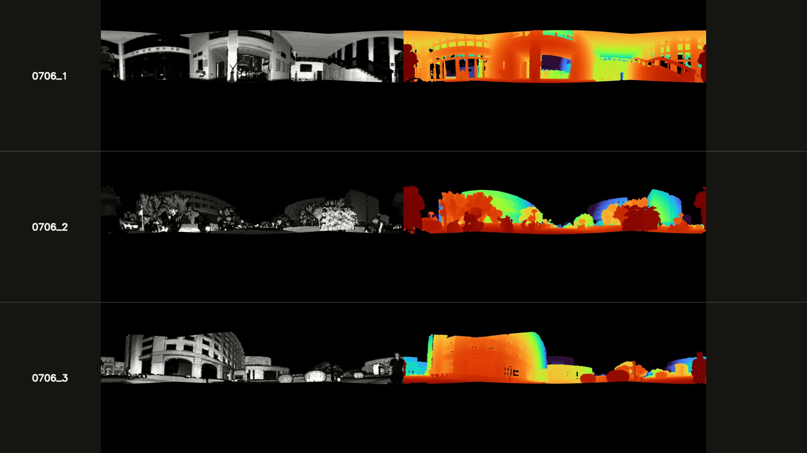](https://www.bilibili.com/video/BV13Ceu6eE2b/)

**[Watch the complete video on Bilibili](https://www.bilibili.com/video/BV13Ceu6eE2b/)** · 28.87 s

#### 0706_1

[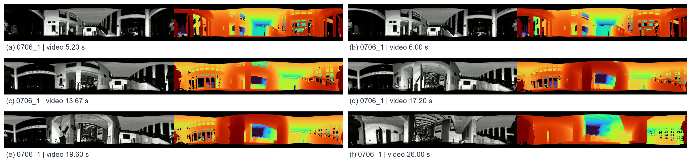](DVGS_GitHub/assets/montages/imaging_0706_0706_1.jpg)

Each pair: relative return intensity (left) and co-registered pseudo-colored radial depth (right). Building contours and surface boundaries can be compared at the six selected viewpoints. **Video times:** (a) 5.20 s; (b) 6.00 s; (c) 13.67 s; (d) 17.20 s; (e) 19.60 s; (f) 26.00 s.

#### 0706_2

[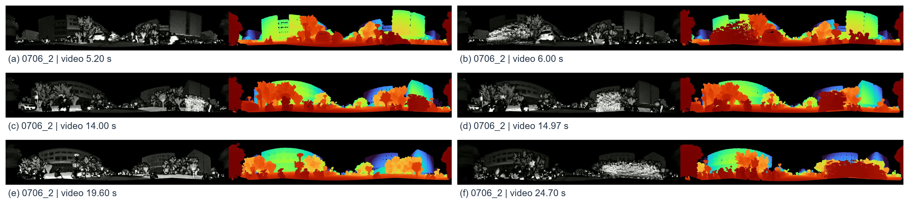](DVGS_GitHub/assets/montages/imaging_0706_0706_2.jpg)

Each pair: relative return intensity (left) and co-registered pseudo-colored radial depth (right). Building contours and surface boundaries can be compared at the six selected viewpoints. **Video times:** (a) 5.20 s; (b) 6.00 s; (c) 14.00 s; (d) 14.97 s; (e) 19.60 s; (f) 24.70 s.

#### 0706_3

[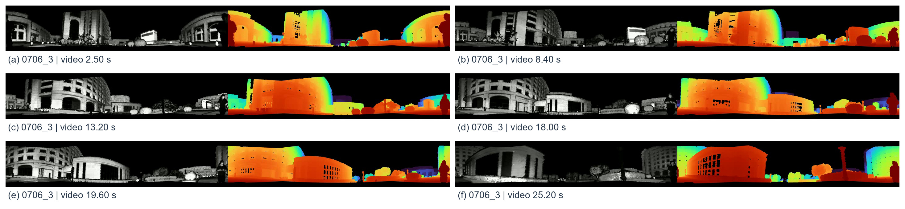](DVGS_GitHub/assets/montages/imaging_0706_0706_3.jpg)

Each pair: relative return intensity (left) and co-registered pseudo-colored radial depth (right). Building contours and surface boundaries can be compared at the six selected viewpoints. **Video times:** (a) 2.50 s; (b) 8.40 s; (c) 13.20 s; (d) 18.00 s; (e) 19.60 s; (f) 25.20 s.

### 0718 sequences

[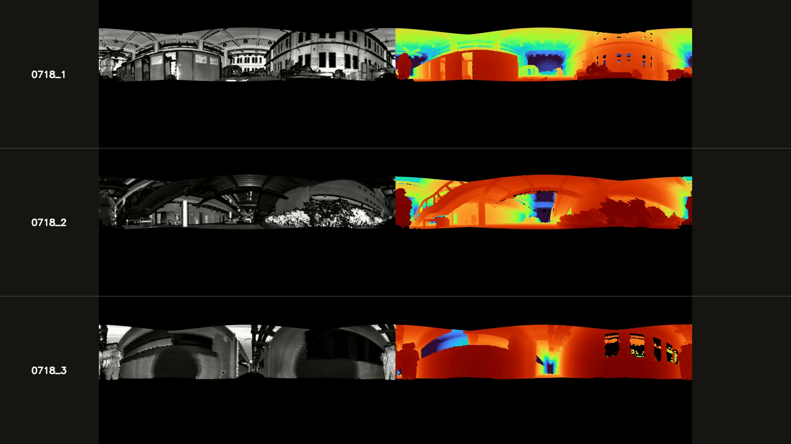](https://www.bilibili.com/video/BV1Gkeu6NEkB/)

**[Watch the complete video on Bilibili](https://www.bilibili.com/video/BV1Gkeu6NEkB/)** · 57.43 s

#### 0718_1

[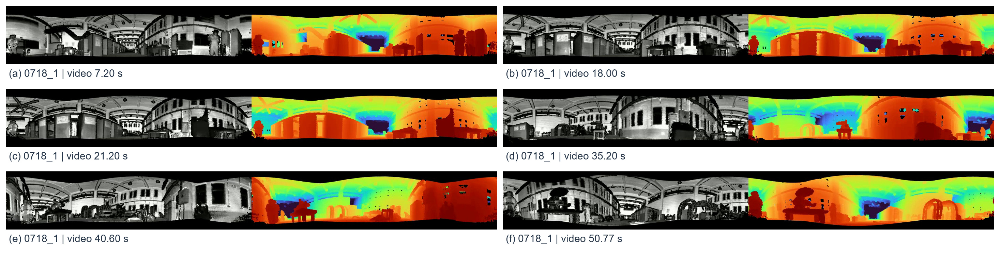](DVGS_GitHub/assets/montages/imaging_0718_0718_1.jpg)

Each pair: relative return intensity (left) and co-registered pseudo-colored radial depth (right). Building contours and surface boundaries can be compared at the six selected viewpoints. **Video times:** (a) 7.20 s; (b) 18.00 s; (c) 21.20 s; (d) 35.20 s; (e) 40.60 s; (f) 50.77 s.

#### 0718_2

[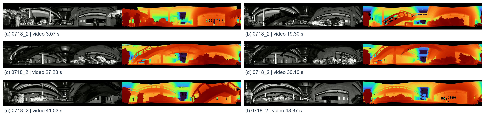](DVGS_GitHub/assets/montages/imaging_0718_0718_2.jpg)

Each pair: relative return intensity (left) and co-registered pseudo-colored radial depth (right). Building contours and surface boundaries can be compared at the six selected viewpoints. **Video times:** (a) 3.07 s; (b) 19.30 s; (c) 27.23 s; (d) 30.10 s; (e) 41.53 s; (f) 48.87 s.

#### 0718_3

[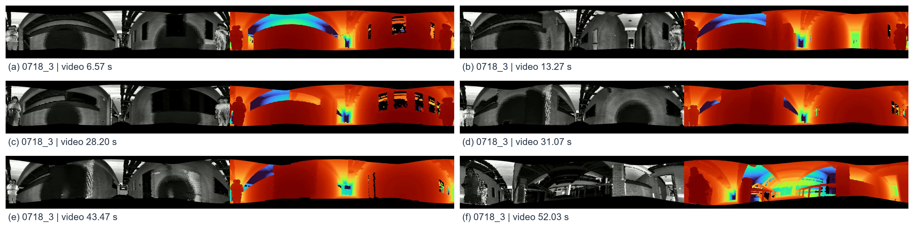](DVGS_GitHub/assets/montages/imaging_0718_0718_3.jpg)

Each pair: relative return intensity (left) and co-registered pseudo-colored radial depth (right). Building contours and surface boundaries can be compared at the six selected viewpoints. **Video times:** (a) 6.57 s; (b) 13.27 s; (c) 28.20 s; (d) 31.07 s; (e) 43.47 s; (f) 52.03 s.

## 2. Visual SLAM and incremental mapping

### 0718 sequences

[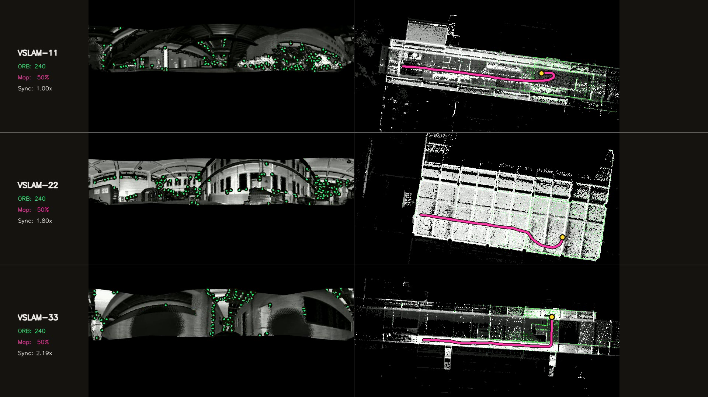](https://www.bilibili.com/video/BV1Xkeu6NE8e/)

**[Watch the complete video on Bilibili](https://www.bilibili.com/video/BV1Xkeu6NE8e/)** · 57.42 s

#### VSLAM-11

[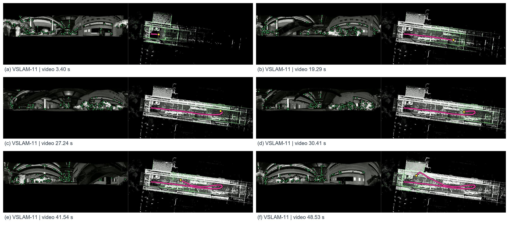](DVGS_GitHub/assets/montages/vslam_0718_VSLAM-11.jpg)

Each pair: ORB features on the intensity image (left) and the source video's incremental point cloud with trajectory (right). The six views show feature observations and successive mapping states. **Video times:** (a) 3.40 s; (b) 19.29 s; (c) 27.24 s; (d) 30.41 s; (e) 41.54 s; (f) 48.53 s.

#### VSLAM-22

[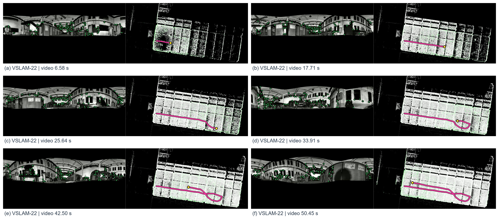](DVGS_GitHub/assets/montages/vslam_0718_VSLAM-22.jpg)

Each pair: ORB features on the intensity image (left) and the source video's incremental point cloud with trajectory (right). The six views show feature observations and successive mapping states. **Video times:** (a) 6.58 s; (b) 17.71 s; (c) 25.64 s; (d) 33.91 s; (e) 42.50 s; (f) 50.45 s.

#### VSLAM-33

[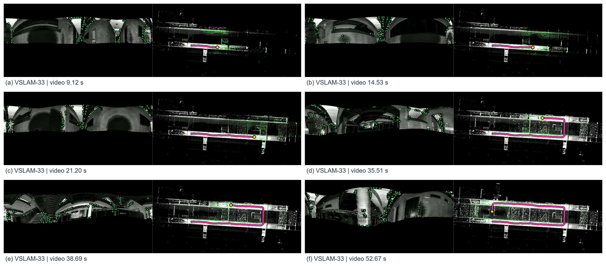](DVGS_GitHub/assets/montages/vslam_0718_VSLAM-33.jpg)

Each pair: ORB features on the intensity image (left) and the source video's incremental point cloud with trajectory (right). The six views show feature observations and successive mapping states. **Video times:** (a) 9.12 s; (b) 14.53 s; (c) 21.20 s; (d) 35.51 s; (e) 38.69 s; (f) 52.67 s.

### 0706 sequences

[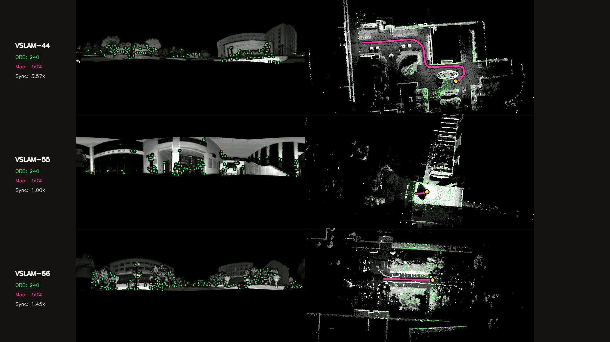](https://www.bilibili.com/video/BV1akeu6NEtk/)

**[Watch the complete video on Bilibili](https://www.bilibili.com/video/BV1akeu6NEtk/)** · 43.26 s

#### VSLAM-44

[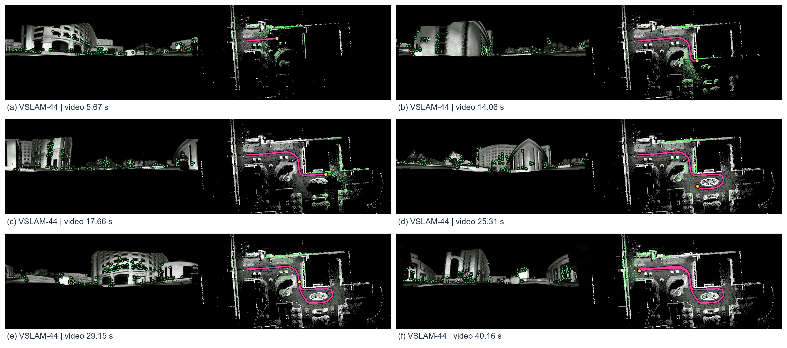](DVGS_GitHub/assets/montages/vslam_0706_VSLAM-44.jpg)

Each pair: ORB features on the intensity image (left) and the source video's incremental point cloud with trajectory (right). The six views show feature observations and successive mapping states. **Video times:** (a) 5.67 s; (b) 14.06 s; (c) 17.66 s; (d) 25.31 s; (e) 29.15 s; (f) 40.16 s.

#### VSLAM-55

[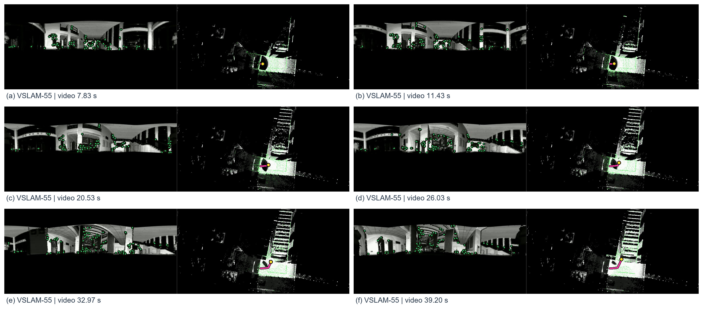](DVGS_GitHub/assets/montages/vslam_0706_VSLAM-55.jpg)

Each pair: ORB features on the intensity image (left) and the source video's incremental point cloud with trajectory (right). The six views show feature observations and successive mapping states. **Video times:** (a) 7.83 s; (b) 11.43 s; (c) 20.53 s; (d) 26.03 s; (e) 32.97 s; (f) 39.20 s.

#### VSLAM-66

[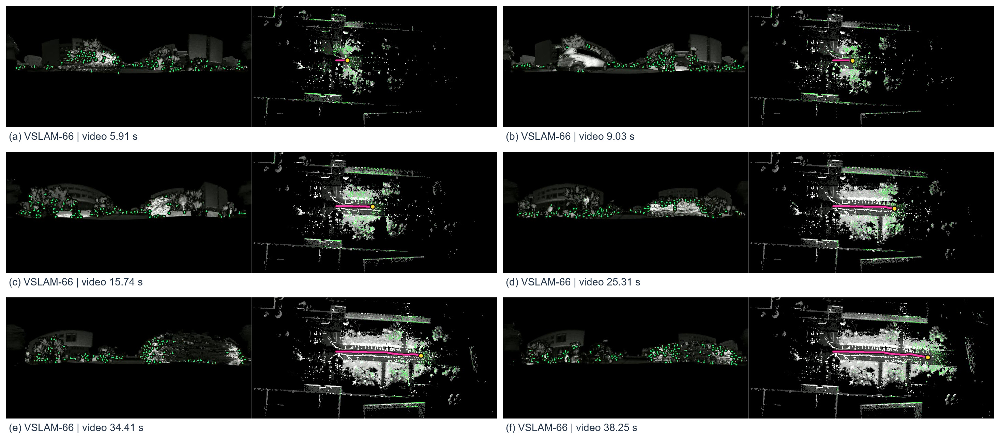](DVGS_GitHub/assets/montages/vslam_0706_VSLAM-66.jpg)

Each pair: ORB features on the intensity image (left) and the source video's incremental point cloud with trajectory (right). The six views show feature observations and successive mapping states. **Video times:** (a) 5.91 s; (b) 9.03 s; (c) 15.74 s; (d) 25.31 s; (e) 34.41 s; (f) 38.25 s.

## Selection and provenance

Six separate intervals cover 4–97% of each supplied video. In each interval, 24 candidates are ranked using a masked Laplacian sharpness score on the grayscale intensity panel. Scoring excludes labels, borders, and colored feature markers. This is a selection heuristic, not a quantitative imaging-quality result.

Paired panels always come from the same decoded frame. The montage preserves the extracted pixel dimensions; it only removes side labels/empty margins and adds captions. High-quality JPEG is used to reduce download size. The original video retains its original labels.

The VSLAM identifiers are copied from the videos and are not assumed to match imaging row indices. Source video playback/synchronization factors are unchanged; playback speed is not a runtime benchmark. Complete videos are hosted externally on Bilibili; this repository contains no video files.

See `DVGS_GitHub/selection_manifest.csv` for source filenames, frame indices, video times and crop coordinates. See `DVGS_GitHub/gallery_manifest.json` for the 12 montage files. Visual selections do not establish trajectory accuracy or replace full-sequence evaluation.

## Rebuild

```bash
cd DVGS_GitHub
pip install -r requirements.txt
python generate_showcase.py --source-dir /path/to/original/videos --output . --skip-video
```

On Windows, `DVGS_GitHub/build.bat` provides the same workflow. The four original files are required. This external-video edition generates images and Bilibili links only; it does not copy or encode video files.
